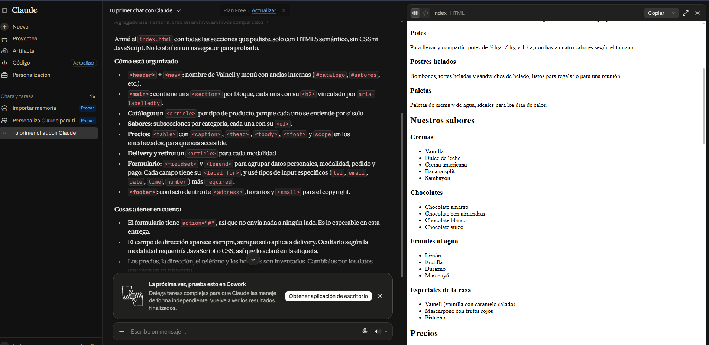

# Prompt 1 - Estructura base del proyecto

## Información general

* **Modelo:** Claude
* **Método:** Zero-shot prompting
* **Integrante que utilizó el prompt:** Alexis Btitez
* **Archivo/sección donde se aplicó:** `index.html` — estructura semántica inicial de la página.
* **Objetivo:** Analizar y proponer la estructura semántica inicial del proyecto Heladería Vainell.

---

## Prompt exacto

```
> Necesito desarrollar la estructura inicial en HTML5 para una página web de una heladería ficticia llamada Vainell. El proyecto consiste en un simulador de pedidos de helado con modalidad delivery o retiro en el local.
>
> La primera entrega debe utilizar únicamente HTML5 semántico, sin CSS ni JavaScript.
>
> La página debe incluir:
>
> * Header con nombre y navegación.
> * Sección de presentación de la heladería.
> * Catálogo de productos.
> * Lista de sabores.
> * Tabla de precios.
> * Explicación sobre delivery y retiro en local.
> * Formulario de pedido.
> * Footer con información de contacto.
>
> Proponé una estructura utilizando etiquetas semánticas HTML5 adecuadas. No agregues funcionalidades que requieran JavaScript o backend.
```



---

## Resultado esperado

Obtener una propuesta de estructura semántica para organizar correctamente el contenido de `index.html` y verificar que incluya los elementos solicitados para la primera entrega.

---

## Resultado obtenido

Se obtuvo una propuesta de estructura base para el proyecto Vainell, definiendo la organización del contenido mediante etiquetas semánticas HTML5. La estructura permitió organizar el encabezado, la sección principal, el catálogo de productos, la información sobre el servicio, el formulario de pedido y el pie de página.

---

## Correcciones manuales

No se realizaron correcciones.

---

## Aporte al proyecto

Este prompt permitió analizar la organización inicial de la página y definir una estructura basada en etiquetas semánticas HTML5 antes de comenzar el desarrollo.

La propuesta se aplicó en `index.html`, donde se estableció la estructura inicial del contenido del sitio.