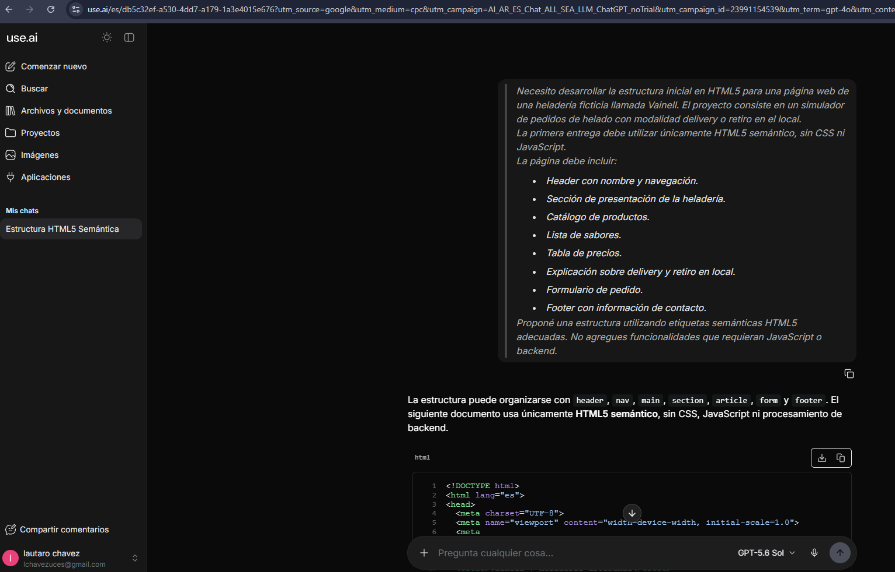

# Prompt 2 - Generación del HTML inicial

## Información general

* **Modelo:** Gemini
* **Método:** Role prompting
* **Integrante que utilizó el prompt:** Alexis Britez
* **Archivo/sección donde se aplicó:** `index.html` — estructura HTML5 inicial.
* **Objetivo:** Obtener una propuesta inicial de código HTML5 para el proyecto.

---

## Prompt exacto

> Actuá como un desarrollador frontend especializado en HTML5 semántico.
>
> Necesito generar una estructura HTML inicial para el proyecto académico "Heladería Vainell".
>
> Se trata de una página web que simula el proceso de pedido de helados para delivery o retiro en el local.
>
> Para esta primera etapa solamente se debe utilizar HTML5. No utilizar CSS ni JavaScript.
>
> El documento debe incluir:
>
> * `<!DOCTYPE html>`
> * Etiqueta html con idioma español.
> * head con charset, viewport y title.
> * header.
> * nav.
> * main.
> * Sección de presentación.
> * Sección de catálogo.
> * Lista de sabores.
> * Tabla con productos y precios.
> * Sección explicando cómo realizar un pedido.
> * Formulario con nombre, contacto, modalidad de entrega y datos relacionados.
> * footer.
>
> Utilizá etiquetas semánticas correctamente y agregá comentarios indicando dónde se incorporará CSS y JavaScript en futuras entregas.
>
> No inventes funcionalidades de backend ni procesamiento real de pagos.

---

## Resultado esperado

Obtener una propuesta de código HTML5 que cumpla con los requerimientos funcionales definidos para la primera entrega del proyecto.

---

## Resultado obtenido

Características destacadas del código:

**Semántica rigurosa:** Hace uso de `header`, `nav`, `main`, `section`, `article`, `fieldset`, `legend`, `table` y `footer` para estructurar la información jerárquicamente.

**Accesibilidad integrada:** Las etiquetas `<label>` están correctamente enlazadas mediante sus atributos `for` e `id` correspondientes con cada `<input>`, `<select>` y `<textarea>`. La tabla cuenta con `<caption>` y `<thead>/<tbody>` para mejorar su estructura y accesibilidad.

**Puntos de extensión CSS/JS:** Se dejaron comentarios explicativos en el `<head>` y antes del `</body>` indicando dónde y cómo se vincularán la capa de estilos e interactividad en las siguientes etapas.

---

## Aporte al proyecto

Este prompt ayudó a generar una base inicial para analizar la estructura de `index.html` y verificar la presencia de los elementos requeridos.

La propuesta se aplicó sobre `index.html`, utilizado como archivo principal de la página durante la primera etapa del proyecto.

