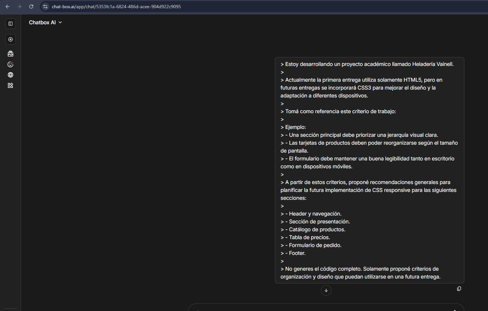

# Prompt 3 - Estilo CSS y diseño responsivo

## Información general

* **Modelo:** Gemini 1.5 Pro
* **Método:** Chatbot
* **Integrante que utilizó el prompt:** Alexis Britez
* **Archivo/sección donde se aplicó:** `index.html` — planificación de estilos para Header, navegación, presentación, catálogo, tabla de precios, formulario y Footer. Implementación prevista para futuras hojas de estilo CSS.
* **Objetivo:** Planificar futuros estilos y criterios de diseño responsivo para el proyecto.

---

## Prompt exacto

```
> Estoy desarrollando un proyecto académico llamado Heladería Vainell.
>
> Actualmente la primera entrega utiliza solamente HTML5, pero en futuras entregas se incorporará CSS3 para mejorar el diseño y la adaptación a diferentes dispositivos.
>
> Tomá como referencia este criterio de trabajo:
>
> Ejemplo:
>
> * Una sección principal debe priorizar una jerarquía visual clara.
> * Las tarjetas de productos deben poder reorganizarse según el tamaño de pantalla.
> * El formulario debe mantener una buena legibilidad tanto en escritorio como en dispositivos móviles.
>
> A partir de estos criterios, proponé recomendaciones generales para planificar la futura implementación de CSS responsive para las siguientes secciones:
>
> * Header y navegación.
> * Sección de presentación.
> * Catálogo de productos.
> * Tabla de precios.
> * Formulario de pedido.
> * Footer.
>
> No generes el código completo. Solamente proponé criterios de organización y diseño que puedan utilizarse en una futura entrega.
```



---

## Resultado esperado

Obtener recomendaciones para planificar la futura incorporación de CSS3 y diseño responsivo sin modificar el alcance actual de la primera entrega.

---

## Resultado obtenido

Se obtuvieron recomendaciones de diseño responsivo para las diferentes secciones del proyecto:

**Header y navegación:**

* Mantener el menú visible y accesible sin saturar el espacio.
* Utilizar una distribución horizontal en escritorio y adaptar la navegación para dispositivos móviles.
* Priorizar íconos y textos legibles, ajustando tamaños y espacios según el dispositivo.

**Sección de presentación:**

* Mantener una jerarquía visual clara entre título, subtítulos y texto.
* Utilizar imágenes adaptables que no interfieran con el contenido.
* Ajustar alineación, márgenes y espaciados según el tamaño de pantalla.

**Catálogo de productos:**

* Utilizar tarjetas flexibles que puedan reorganizarse según el ancho disponible.
* Mantener las proporciones de las imágenes.
* Asegurar tamaños adecuados para textos y elementos interactivos.

**Tabla de precios:**

* Evitar tablas demasiado anchas que generen problemas de visualización en dispositivos móviles.
* Considerar alternativas de presentación para pantallas pequeñas.
* Mantener una tipografía legible y una estructura clara.

**Formulario de pedido:**

* Colocar etiquetas de los campos de forma clara.
* Adaptar campos y botones al ancho disponible.
* Mantener un orden lógico y una organización visual adecuada.

**Footer:**

* Organizar la información en bloques.
* Adaptar la distribución de horizontal a vertical en dispositivos móviles.
* Mantener textos legibles y suficiente espaciado.

---

## Correcciones manuales

No se realizaron correcciones.

---

## Aporte al proyecto

Este prompt permitió anticipar criterios de diseño para futuras entregas sin incorporar CSS antes de la etapa prevista.

Las recomendaciones se aplicaron como planificación sobre las diferentes secciones estructurales de `index.html`, dejando definida una referencia para la futura implementación de CSS3 y diseño responsivo.