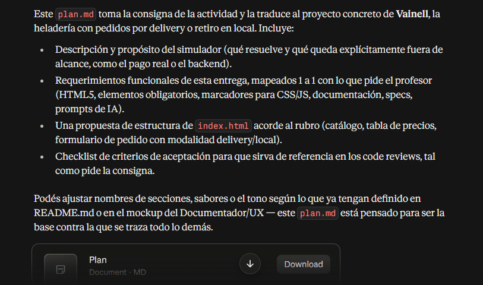

# Prompt 4 - Creación del plan.

## Información general

* **Modelo:** Figma ai
* **Método:** Contextual prompting
* **Integrante que utilizó el prompt:** Alexis Britez
* **Archivo/sección donde se aplicó:** Mockup visual en Figma — frames correspondientes al Header, navegación, presentación, catálogo, sabores, precios, modalidades de pedido, formulario y Footer.
* **Objetivo:** Obtener una propuesta visual para el mockup del proyecto Heladería Vainell.

---

## Prompt exacto
quiero que me generes un mockup de una heladeria que se llame Vainell y quiero que crees al "Capitan Helado" un personaje ficticio con una cara adorable pero con un fisico como el de superman, que utilice un verde como el helado de menta y combinado con un color como el dulce de leche


utiliza esta base para crear ese mockup:


Voy a basarme en el plan del proyecto para proponerte una estructura de landing page clara, profesional y alineada con la consigna.


## Propuesta de layout para la página principal


Tomando como base la definición del proyecto en `plan.md`, la página principal debe funcionar como una landing page comercial de una heladería moderna, con foco en tres objetivos claros: vender la propuesta de valor, mostrar productos y guiar al usuario hacia el pedido.


---


## 1. Estructura recomendada de la página


### A. Header fijo o sticky

Debe incluir:

- Logo o nombre Vainell

- Navegación principal: Inicio, Catálogo, Cómo pedir, Formulario, Contacto

- Botón de acción principal: Pedir ahora o Ver sabores


Esto da identidad institucional y permite navegar rápido sin perder contexto.


### B. Hero section

Es la sección más importante visualmente.


Debe contar con:

- Texto principal: “Helados para disfrutar en cada momento”

- Subtítulo corto con propuesta de valor

- Dos CTAs:

  - Ver catálogo

  - Hacer mi pedido

- Imagen principal de helados o del local

- Indicadores secundarios: delivery, sabores artesanales, atención rápida


Recomendación visual:

- Texto a la izquierda, imagen a la derecha

- Gran contraste para captar atención

- Altura suficiente para sentirse premium, no demasiado larga


### C. Sección de beneficios o propuesta de valor

Aquí se explican razones por las que elegir Vainell.


Ideas:

- Sabores artesanales

- Delivery y retiro en local

- Atención rápida

- Productos para todas las ocasiones


Formato recomendado:

- 3 o 4 tarjetas con icono + título + texto breve


### D. Catálogo de productos

Debe reflejar lo que dice el plan: sabores, formatos, precios y variedad.


Estructura sugerida:

- Encabezado con título

- Filtros o botones: Kilo, Potes, Palitos, Tortas, Toppings

- Grid de tarjetas con:

  - nombre del producto,

  - descripción corta,

  - precio,

  - botón “Agregar”

- Opción de mostrar tabla con precios por formato


Esto mantiene la página clara y orientada a la compra.


### E. Sección “Cómo pedir”

Aquí se debe explicar el flujo del pedido en pocas etapas.


Ejemplo:

1. Elegir tu producto

2. Seleccionar delivery o retiro

3. Completar datos

4. Confirmar pedido


Visualmente conviene usar una línea horizontal o pasos numerados con iconos.


### F. Formulario de pedido

Es clave por el alcance del proyecto en `plan.md`. Debe ser visible y bien jerarquizado.


Campos sugeridos:

- Nombre y apellido

- Teléfono

- Modalidad: entrega o retiro

- Dirección / horario de retiro

- Comentarios

- Medio de pago declarado

- Botón “Confirmar pedido”


Importante:

- La elección entre delivery y retiro debe cambiar dinámicamente la información requerida.

- El formulario debe estar en una zona clara, no oculto ni demasiado abajo.


### G. Sección de testimonios o contexto del local

Opcional, pero útil para reforzar credibilidad.


Puede incluir:

- Opiniones de clientes

- Mensaje de la marca

- Eslogan o historia de Vainell


### H. Footer

Debe contener:

- Logo y nombre

- Horarios de atención

- Datos de contacto

- Redes sociales

- Enlaces rápidos

- Dirección o localidad


---


## 2. Jerarquía visual recomendada


La lógica visual debe seguir este orden:


1. H1: nombre de la marca y propuesta principal

2. H2: secciones importantes

3. H3: subtítulos dentro de tarjetas o productos

4. Texto breve y claro en cuerpo principal

5. CTAs con mayor contraste y prioridad


Regla práctica:

- El usuario debe entender en 3 segundos qué es Vainell, qué ofrece y cómo pedir.


---


## 3. Sistema visual sugerido


### Paleta

Una propuesta moderna y agradable para heladería puede ser:

- Blanco / crema para fondo limpio

- Rosa pastel o frambuesa para acentos

- Celeste o turquesa para detalle fresco

- Azul oscuro o verde profundo para texto principal

- Beige cálido para un tono artesanal


Esto transmite:

- frescura,

- confianza,

- calor comercial,

- calidad premium.


### Tipografía

- Título principal: bold, grande, con personalidad

- Subtítulos: claros y marcados

- Cuerpo: legible, con buena densidad

- Botones: llamativos pero consistentes


### Espaciado

Usar una escala uniforme:

- 8px base

- 16, 24, 32, 48, 64 px según importancia


Esto hace que la página se vea ordenada y profesional.


---


## 4. Recomendación de composición general


La recomendación más sólida para una landing page de Vainell es esta:


- Header fijo

- Hero con CTA principal

- Beneficios

- Catálogo destacado

- Cómo pedir

- Formulario

- Testimonios o valor de marca

- Footer


Esto responde exactamente a la intención del proyecto en `plan.md`: mostrar catálogo, explicar modalidad de compra y permitir una experiencia de pedido realista.


---


## 5. Consejo de diseño para una mejor conversión


Para que la página no se vea solo informativa, cada bloque debe terminar en una acción clara:

- Ver catálogo

- Elegir sabor

- Pedir ahora

- Confirmar pedido


La página principal debe guiar al usuario hacia la intención de compra, no solo presentar información.


---


## 6. Resumen ejecutivo


La estructura más efectiva para Vainell es una landing page comercial con:

- hero potente,

- catálogo visual,

- explicación de flujo de compra,

- formulario destacado,

- identidad fresca y moderna.


Eso encaja con la propuesta del proyecto en `plan.md` y funciona muy bien en una primera entrega HTML, con posibilidad de evolución a CSS y JavaScript.


Si quieres, en el siguiente paso te puedo armar una versión más detallada con:

1. wireframe por secciones,

2. estructura exacta de HTML,

3. jerarquía de títulos y contenido,

4. propuesta de estilo visual para la landing page

---

## Resultado esperado

Obtener un plan más detallado con respecto a las características de la página, que ayude a ampliar la idea y trasladarla a un formato más formal, entendible y completo.

---

## Resultado obtenido

```
Este plan.md toma la consigna de la actividad y la traduce al proyecto concreto de Vainell, la heladería con pedidos por delivery o retiro en local. Incluye:

- Descripción y propósito del simulador (qué resuelve y qué queda explícitamente fuera de alcance, como el pago real o el backend).
- Requerimientos funcionales de esta entrega, mapeados 1 a 1 con lo que pide el profesor (HTML5, elementos obligatorios, marcadores para CSS/JS, documentación, specs, prompts de IA).
- Una propuesta de estructura de index.html acorde al rubro (catálogo, tabla de precios, formulario de pedido con modalidad delivery/local).
- Checklist de criterios de aceptación para que sirva de referencia en los code reviews, tal como pide la consigna.

Podés ajustar nombres de secciones, sabores o el tono según lo que ya tengan definido en README.md o en el mockup del Documentador/UX — este plan.md está pensado para ser la base contra la que se traza todo lo demás.
```



---

## Correcciones manuales

Se realizaron correcciones mínimas con respecto a los títulos y funciones que iba a tener la página. Además de incluir un sistema de inicio de sesión.

---

## Aporte al proyecto

Este prompt ayudó a realizar el plan de la página, es decir, de qué tratará, qué hará y que otras características tendrá.