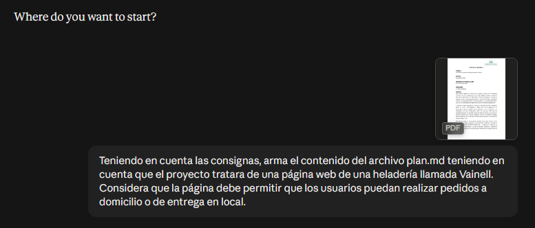

# Prompt 4 - Creación del mockup

## Información general

* **Modelo:** ChatGPT
* **Método:** Contextual prompting
* **Integrante que utilizó el prompt:** Alexis Britez
* **Archivo/sección donde se aplicó:** Mockup visual en Figma — frames correspondientes al Header, navegación, presentación, catálogo, sabores, precios, modalidades de pedido, formulario y Footer.
* **Objetivo:** Obtener una propuesta visual para el mockup del proyecto Heladería Vainell.

---

## Prompt exacto

> Necesito crear un mockup para una página web de una heladería ficticia llamada Vainell.
>
> La página representa un simulador de pedidos de helados para delivery o retiro en el local.
>
> El diseño debe contemplar las siguientes secciones:
>
> * Header con logo o nombre de la heladería.
> * Navegación.
> * Sección principal de presentación.
> * Catálogo de productos.
> * Sabores disponibles.
> * Tabla o sección de precios.
> * Explicación sobre las modalidades de pedido.
> * Formulario para simular un pedido.
> * Footer con información de contacto.
>
> El objetivo es crear una propuesta visual clara que posteriormente pueda utilizarse como referencia para el desarrollo frontend.
>
> Priorizá la organización visual y la experiencia del usuario.

---

## Resultado esperado

Obtener una propuesta visual que permita definir la organización y jerarquía de las secciones de la página.

---

## Resultado obtenido

La IA generó un mockup visual de la página web de la heladería Vainell, organizando las secciones principales del proyecto: encabezado y navegación, presentación, catálogo de productos, sabores disponibles, precios, modalidades de pedido, formulario para simular un pedido y pie de página.

El resultado permitió obtener una referencia visual de la distribución de los elementos y de la organización general de la página, que puede utilizarse como guía para el posterior desarrollo frontend.

---

## Correcciones manuales

Se separó frame por frame con Claude.ai para facilitar la organización y utilización del mockup.

---

## Aporte al proyecto

Este prompt aportó una referencia para la organización visual del sitio y facilitó la planificación de la interfaz.

El resultado se aplicó en el mockup de Figma, utilizando los diferentes frames como referencia visual para las secciones que posteriormente serán desarrolladas en el proyecto frontend.

