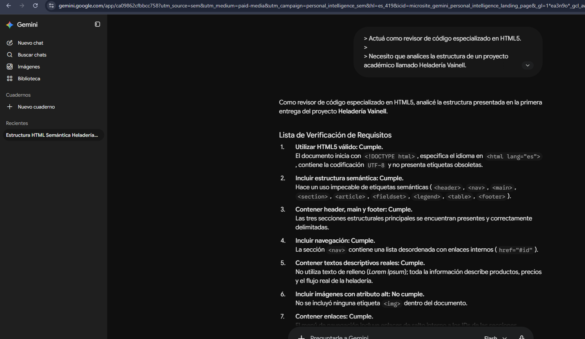

# Prompt 5 - Optimización y validación del código

## Información general

* **Modelo:** Gemini
* **Método:** Chain-of-thought guiado
* **Integrante que utilizó el prompt:** Alexis Britez
* **Archivo/sección donde se aplicó:** `index.html` — revisión y validación de la estructura HTML5, contenido, navegación, tabla, formulario y requisitos de la primera entrega.
* **Objetivo:** Revisar el código HTML y verificar su cumplimiento con los requerimientos del proyecto.

---

## Prompt exacto

```
> Actuá como revisor de código especializado en HTML5.
>
> Necesito que analices la estructura de un proyecto académico llamado Heladería Vainell.
>
> La primera entrega debe cumplir los siguientes requisitos:
>
> 1. Utilizar HTML5 válido.
> 2. Incluir estructura semántica.
> 3. Contener header, main y footer.
> 4. Incluir navegación.
> 5. Contener textos descriptivos reales.
> 6. Incluir imágenes con atributo alt.
> 7. Contener enlaces.
> 8. Incluir una lista.
> 9. Incluir una tabla con th y td.
> 10. Contener un formulario de pedido.
> 11. Permitir indicar delivery o retiro en local.
> 12. No utilizar todavía CSS ni JavaScript funcional.
> 13. Incluir comentarios indicando futuras integraciones de CSS y JavaScript.
>
> Analizá el código paso a paso y generá una lista de verificación.
>
> Para cada requisito indicá:
>
> * Cumple.
> * No cumple.
> * Requiere revisión.
>
> Si detectás un problema, explicá brevemente cómo podría corregirse sin modificar innecesariamente la estructura existente.
```



---

## Resultado esperado

Obtener una revisión estructurada del código para detectar posibles errores o incumplimientos antes de realizar la entrega.

---

## Resultado obtenido

### Lista de Verificación de Requisitos

**Utilizar HTML5 válido: Cumple.**

El documento inicia con `<!DOCTYPE html>`, especifica el idioma en `<html lang="es">`, contiene la codificación UTF-8 y no presenta etiquetas obsoletas.

**Incluir estructura semántica: Cumple.**

Hace uso de etiquetas semánticas como `<header>`, `<nav>`, `<main>`, `<section>`, `<article>`, `<fieldset>`, `<legend>`, `<table>` y `<footer>`.

**Contener header, main y footer: Cumple.**

Las tres secciones estructurales principales se encuentran presentes y correctamente delimitadas.

**Incluir navegación: Cumple.**

La sección `<nav>` contiene una lista desordenada con enlaces internos mediante `href="#id"`.

**Contener textos descriptivos reales: Cumple.**

No utiliza texto de relleno (Lorem Ipsum); la información describe los productos, precios y el funcionamiento de la heladería.

**Incluir imágenes con atributo alt: No cumple.**

No se incluyó ninguna etiqueta `` dentro del documento.

**Contener enlaces: Cumple.**

El menú de navegación incluye enlaces internos a las diferentes secciones.

**Incluir una lista: Cumple.**

Se utilizan listas desordenadas (`<ul>`) para el menú y los sabores, y una lista ordenada (`<ol>`) para los pasos de compra.

**Incluir una tabla con th y td: Cumple.**

La tabla de precios utiliza `<caption>`, `<thead>`, `<tbody>`, `<th>` y `<td>`.

**Contener un formulario de pedido: Cumple.**

Se implementa un elemento `<form>` con campos de texto, correo, teléfono, menú desplegable y áreas de texto.

**Permitir indicar delivery o retiro en local: Cumple.**

## Correcciones manuales

Se agregaron más imagenes al código.

## Aporte al proyecto

Este prompt ayudó a realizar las últimas correcciones al código html y verificar que sea completamente funcional.