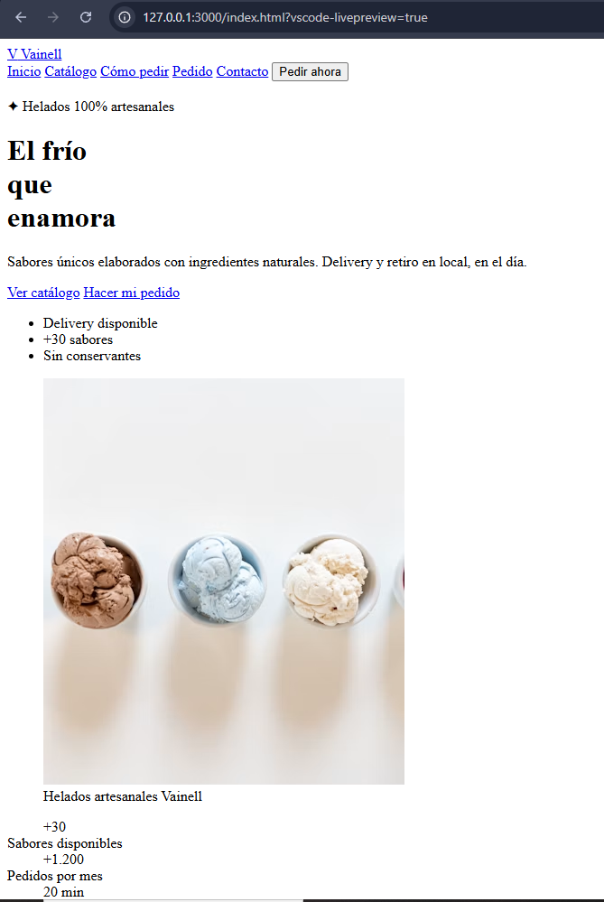

# Test Case 1 — Compatibilidad de escritorio

## Objetivo

Verificar que la página web de Heladería Vainell se visualice y funcione correctamente en los principales navegadores de escritorio.

## Alcance

Se probará la página utilizando los siguientes navegadores:

* Google Chrome
* Mozilla Firefox
* Microsoft Edge
* Safari

## Herramienta utilizada

**Playwright MCP**, utilizado desde GitHub Copilot en Agent Mode para controlar el navegador y realizar las verificaciones.

## URL de prueba

```text
http://127.0.0.1:3000/index.html?vscode-livepreview=true
```

## Criterios de verificación

Para cada navegador se verificará:

* Que la página cargue correctamente.
* Que el título de la página sea "Heladeria Vainell".
* Que la navegación principal sea visible.
* Que la sección principal (hero) se renderice correctamente.
* Que el catálogo de productos sea visible.
* Que el formulario sea visible.
* Que no se produzcan errores que impidan utilizar la página.

## Prompt utilizado

```text
Usa Playwright MCP para realizar una prueba de compatibilidad de escritorio sobre la aplicación local de Heladería Vainell.

URL:
http://127.0.0.1:3000/index.html?vscode-livepreview=true

Verifica la página en Chrome, Firefox, Safari y Edge.

Para cada navegador comprueba:
- que la página cargue correctamente;
- que el título sea "Heladeria Vainell";
- que la navegación, hero section, catálogo y formulario sean visibles;
- que no haya errores que impidan utilizar la página.

Registra los resultados de cada navegador y toma capturas de pantalla como evidencia.

No modifiques ningún archivo del proyecto.
```

## Resultado

## Resultado de la ejecución

La prueba de compatibilidad completa no pudo finalizarse mediante Playwright MCP debido a que los navegadores necesarios para la ejecución automatizada no quedaron instalados correctamente en el entorno.

Durante el intento se verificó que:

* La aplicación puede abrirse correctamente mediante Live Preview.
* El título de la página es **"Heladeria Vainell"**.
* La cabecera, hero section, catálogo y formulario se renderizan correctamente.
* Chrome está instalado en el sistema.
* Microsoft Edge está instalado en el sistema.
* Firefox no se encontró instalado en la ruta estándar.
* Safari no está disponible de forma nativa en Windows.
* Playwright no pudo descargar correctamente los motores Chromium, Firefox y WebKit debido a un timeout durante la descarga.

### Resultados por navegador

| Navegador     | Resultado     | Observación                                                                       |
| ------------- | ------------- | --------------------------------------------------------------------------------- |
| Chrome        | No verificado | No se pudo ejecutar mediante Playwright MCP                                       |
| Firefox       | No verificado | No se encontró instalado y Playwright no pudo completar la descarga               |
| Safari/WebKit | No verificado | Safari no está disponible de forma nativa en Windows y WebKit no pudo descargarse |
| Edge          | No verificado | No se pudo ejecutar mediante Playwright MCP                                       |

## Evidencia

La evidencia visual de la carga de la aplicación se encuentra en:




URL utilizada:

http://127.0.0.1:3000/index.html?vscode-livepreview=true

La captura corresponde a la página cargada mediante Live Preview y permite visualizar la interfaz de Heladería Vainell.

## Issues generados

No se generó un issue de bug por esta ejecución.

La imposibilidad de completar la prueba se debe a una limitación del entorno de ejecución de Playwright y no a un comportamiento defectuoso comprobado de la aplicación.

## Conclusión

**Prueba incompleta por limitación del entorno.**

No se encontraron evidencias de un bug funcional durante la carga de la página, pero tampoco se puede certificar la compatibilidad con Chrome, Firefox, Safari/WebKit y Edge mediante Playwright MCP hasta disponer de los motores de navegador necesarios.


### Chrome

* Estado: Pendiente.
* Observaciones: Pendiente.
* Evidencia: Pendiente.

### Firefox

* Estado: Pendiente.
* Observaciones: Pendiente.
* Evidencia: Pendiente.

### Safari

* Estado: Pendiente.
* Observaciones: Pendiente.
* Evidencia: Pendiente.

### Edge

* Estado: Pendiente.
* Observaciones: Pendiente.
* Evidencia: Pendiente.

## Issues generados

**Pendiente de ejecución.**

Los issues se crearán mediante GitHub MCP únicamente cuando se detecten problemas que correspondan a bugs.

## Conclusión

**Pendiente de ejecución.**
